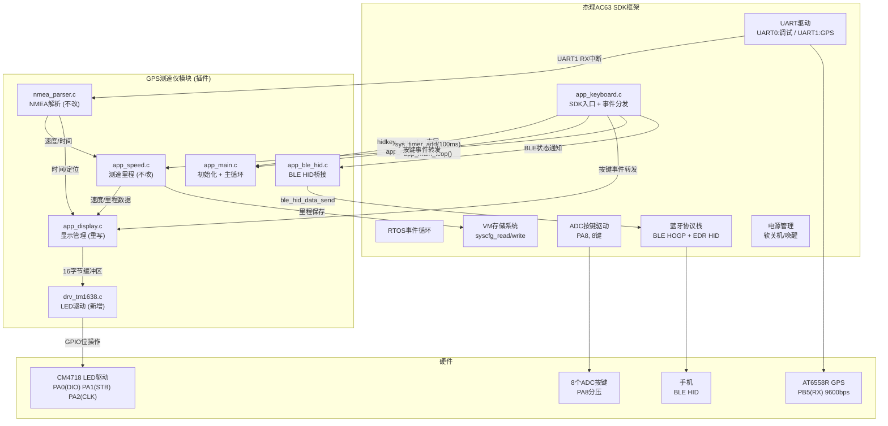
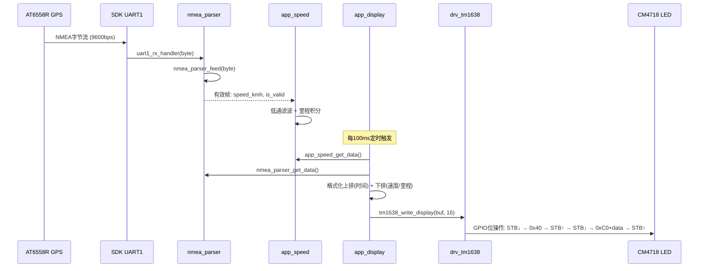
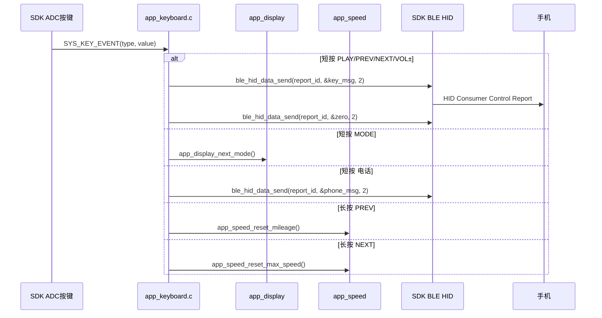

# 设计文档：GPS测速仪固件SDK集成

## 概述

本设计将已有的GPS测速仪业务逻辑代码以"插件"方式嫁接到杰理AC6323A蓝牙SDK框架中。核心改动包括：

1. **TM1638驱动层**：替换原有I2C驱动，实现GPIO位操作的三线串行协议（DIO/CLK/STB）
2. **显示模块重写**：从6位单排改为9位双排（上排时间 + 下排里程/速度），16字节显示缓冲区
3. **SDK集成架构**：通过3个接口点（定时回调、按键事件转发、BLE状态通知）挂载到SDK
4. **HAL层适配**：移除I2C/GPIO按键，新增TM1638驱动调用，桥接SDK的UART/VM/BLE接口
5. **板级配置**：解决PA0/PA1引脚冲突，适配8键ADC、GPS UART1

设计原则：**SDK是主体，GPS模块是插件**。不修改SDK核心架构，仅在SDK提供的扩展点插入GPS功能代码。

## 架构

### 系统架构图



### 集成接口点

SDK与GPS模块之间通过3个接口点连接：

| 接口点 | 位置 | 方向 | 说明 |
|--------|------|------|------|
| 定时回调 | `hidkey_app_start()` 末尾 | SDK → GPS | `sys_timer_add(NULL, gps_timer_cb, 100)` 驱动主循环 |
| 按键事件 | `hidkey_app_key_deal_test()` | SDK → GPS | 根据key_value/event_type分发到GPS功能或HID发送 |
| BLE状态 | `hidkey_bt_connction_status_event_handler()` | SDK → GPS | `gps_ble_connection_notify(bool)` 通知连接状态 |


### 数据流





## 组件与接口

### 模块清单与改动范围

| 模块 | 文件 | 改动程度 | 说明 |
|------|------|----------|------|
| TM1638驱动 | `drv_tm1638.c/h` | **新增** | GPIO位操作三线串行协议 |
| 显示管理 | `app_display.c/h` | **重写** | 双排显示 + TM1638接口 |
| HAL层 | `hal_ac6323a.c` | **重写** | 移除I2C/GPIO按键，新增TM1638 |
| HAL接口 | `hal.h` | **修改** | 移除I2C/GPIO，新增TM1638接口 |
| 主应用 | `app_main.c` | **简化** | 移除按键扫描和BLE轮询 |
| BLE HID | `app_ble_hid.c/h` | **修改** | 新增电话键码 |
| 配置 | `config.h` | **修改** | KEY_NUM=8, DISPLAY_DIGITS=9 |
| 按键模块 | `app_key.c/h` | **删除** | 由SDK ADC按键框架替代 |
| NMEA解析 | `nmea_parser.c/h` | 不改 | — |
| 测速里程 | `app_speed.c/h` | 不改 | — |
| SDK入口 | `app_keyboard.c` | **修改** | 挂载GPS初始化 + 按键分发 |
| SDK板级配置 | `board_ac6323a_demo_cfg.h` | **修改** | 引脚/按键/UART配置 |
| SDK板级初始化 | `board_ac6323a_demo.c` | **修改** | 新增UART1结构体 |

### 组件接口定义

#### 1. TM1638驱动 (`drv_tm1638.h`)

```c
#ifndef _DRV_TM1638_H_
#define _DRV_TM1638_H_

#include <stdint.h>
#include <stdbool.h>

/* TM1638命令定义 */
#define TM1638_CMD_DATA_AUTO_ADDR   0x40  /* 数据命令：自动递增地址 */
#define TM1638_CMD_DATA_FIXED_ADDR  0x44  /* 数据命令：固定地址 */
#define TM1638_CMD_DATA_READ_KEY    0x42  /* 数据命令：读按键 */
#define TM1638_CMD_ADDR_BASE        0xC0  /* 地址命令基址 (0xC0~0xCF) */
#define TM1638_CMD_DISP_OFF         0x80  /* 显示控制：关闭 */
#define TM1638_CMD_DISP_ON_BASE     0x88  /* 显示控制：开启 + 亮度0 */

#define TM1638_DISPLAY_RAM_SIZE     16    /* 显示RAM大小：8 GRID × 2 bytes */
#define TM1638_GRID_COUNT           8     /* GRID数量 */
#define TM1638_BRIGHTNESS_MAX       7     /* 最大亮度等级 */

/* 错误码 */
#define TM1638_OK                   0
#define TM1638_ERR_GPIO_INIT        -1

/**
 * 初始化TM1638驱动
 * 配置PA0(DIO), PA1(STB), PA2(CLK)为GPIO输出
 * 发送初始化命令序列: 0x40 → 0xC0+全零 → 0x8F
 * @return TM1638_OK 成功, TM1638_ERR_GPIO_INIT 失败
 */
int tm1638_init(void);

/**
 * 向TM1638发送单个命令字节
 * 时序: STB↓ → shiftOut(cmd) → STB↑
 * @param cmd 命令字节
 */
void tm1638_send_command(uint8_t cmd);

/**
 * 自动递增模式写入完整显示RAM
 * 时序: STB↓→0x40→STB↑ → STB↓→0xC0→data[0..15]→STB↑
 * @param data 16字节显示数据
 */
void tm1638_write_display(const uint8_t *data);

/**
 * 固定地址模式写入单个GRID
 * 时序: STB↓→0x44→STB↑ → STB↓→(0xC0+addr)→data→STB↑
 * @param grid_addr GRID地址 (0x00~0x0F)
 * @param data 数据字节
 */
void tm1638_write_grid(uint8_t grid_addr, uint8_t data);

/**
 * 设置显示亮度
 * @param brightness 亮度等级 0~7 (0最暗, 7最亮)
 * @param on true=开启显示, false=关闭显示
 */
void tm1638_set_brightness(uint8_t brightness, bool on);

/**
 * LSB优先移出一个字节
 * 在CLK上升沿将DIO数据采样，低位先发
 * @param byte 要发送的字节
 */
void tm1638_shift_out(uint8_t byte);

#endif /* _DRV_TM1638_H_ */
```

#### 2. 显示管理 (`app_display.h`) — 重写后

```c
#ifndef _APP_DISPLAY_H_
#define _APP_DISPLAY_H_

#include <stdint.h>
#include <stdbool.h>

/* 显示模式 */
typedef enum {
    DISPLAY_MODE_SPEED,      /* 上排:时间  下排:速度 */
    DISPLAY_MODE_MILEAGE,    /* 上排:时间  下排:里程 */
    DISPLAY_MODE_TIME,       /* 上排:时间  下排:日期/速度 */
    DISPLAY_MODE_MAX_SPEED,  /* 上排:时间  下排:最高速度 */
    DISPLAY_MODE_COUNT
} display_mode_t;

/**
 * 初始化显示模块（调用tm1638_init）
 */
void app_display_init(void);

/**
 * 刷新显示（每100ms调用一次）
 * 根据当前模式格式化上排+下排，写入16字节到TM1638
 */
void app_display_update(void);

/**
 * 设置显示模式
 */
void app_display_set_mode(display_mode_t mode);
display_mode_t app_display_get_mode(void);

/**
 * 切换到下一个显示模式（循环）
 */
void app_display_next_mode(void);

/**
 * 设置冒号闪烁状态
 * @param blink true=冒号闪烁（每秒切换）, false=常亮
 */
void app_display_set_colon_blink(bool blink);

#endif
```

#### 3. HAL接口 (`hal.h`) — 修改后

```c
#ifndef _HAL_H_
#define _HAL_H_

#include <stdint.h>
#include <stdbool.h>

/*--- UART (GPS通信) ---*/
typedef void (*hal_uart_rx_cb_t)(uint8_t *data, uint16_t len);
void hal_uart_init(uint32_t baudrate, hal_uart_rx_cb_t rx_callback);
void hal_uart_send(const uint8_t *data, uint16_t len);

/*--- TM1638 LED驱动 (替代原I2C) ---*/
/* TM1638接口由drv_tm1638.h直接提供，HAL层不再封装 */

/*--- Flash (掉电存储，桥接SDK VM系统) ---*/
void hal_flash_init(void);
bool hal_flash_write(uint32_t addr, const uint8_t *data, uint16_t len);
bool hal_flash_read(uint32_t addr, uint8_t *data, uint16_t len);

/*--- BLE (桥接SDK蓝牙协议栈) ---*/
typedef void (*hal_ble_connect_cb_t)(bool connected);
void hal_ble_init(const char *device_name, hal_ble_connect_cb_t cb);
bool hal_ble_is_connected(void);
bool hal_ble_hid_send_consumer_key(uint16_t key_bitfield);
void hal_ble_hid_send_phone_key(bool press);

/* BLE HID Consumer Control 位域 (与SDK hidkey_report_map对应) */
#define HID_CONSUMER_VOLUME_INC         0x0001
#define HID_CONSUMER_VOLUME_DEC         0x0002
#define HID_CONSUMER_PLAY_PAUSE         0x0004
#define HID_CONSUMER_MUTE               0x0008
#define HID_CONSUMER_SCAN_PREV_TRACK    0x0010
#define HID_CONSUMER_SCAN_NEXT_TRACK    0x0020

/*--- 系统 ---*/
uint32_t hal_get_tick_ms(void);
void hal_delay_ms(uint32_t ms);
void hal_system_init(void);

#endif /* _HAL_H_ */
```

#### 4. BLE HID (`app_ble_hid.h`) — 修改后

```c
#ifndef _APP_BLE_HID_H_
#define _APP_BLE_HID_H_

#include <stdbool.h>

typedef enum {
    BLE_ACTION_PLAY_PAUSE,
    BLE_ACTION_NEXT_TRACK,
    BLE_ACTION_PREV_TRACK,
    BLE_ACTION_VOL_UP,
    BLE_ACTION_VOL_DOWN,
    BLE_ACTION_PHONE,       /* 新增：电话接听/挂断 */
} ble_action_t;

void app_ble_hid_init(void);
bool app_ble_hid_send_action(ble_action_t action);
bool app_ble_hid_is_connected(void);

/* SDK回调：BLE连接状态变化通知 */
void gps_ble_connection_notify(bool connected);

#endif
```


## 数据模型

### 1. TM1638显示RAM布局

```
地址    内容                    对应显示位
0x00    GRID1 SEG1~SEG8        上排D1(时十位) 7段
0x01    GRID1 SEG9~SEG10       上排冒号1上点
0x02    GRID2 SEG1~SEG8        上排D2(时个位) 7段
0x03    GRID2 SEG9~SEG10       上排冒号1下点
0x04    GRID3 SEG1~SEG8        上排D3(分十位) 7段
0x05    GRID3 SEG9~SEG10       上排冒号2上点
0x06    GRID4 SEG1~SEG8        上排D4(分个位) 7段
0x07    GRID4 SEG9~SEG10       上排冒号2下点
0x08    GRID5 SEG1~SEG8        上排D5(秒个位) 7段
0x09    GRID5 SEG9~SEG10       (空)
0x0A    GRID6 SEG1~SEG8        下排D6(千位) 7段
0x0B    GRID6 SEG9~SEG10       下排冒号3上点
0x0C    GRID7 SEG1~SEG8        下排D7(百位) 7段
0x0D    GRID7 SEG9~SEG10       下排冒号3下点 / 小数点
0x0E    GRID8 SEG1~SEG8        下排D8(十位) 7段 (注: 需实测确认)
0x0F    GRID8 SEG9~SEG10       下排D9(个位) 或扩展
```

> ⚠️ 以上GRID→物理数码管的映射为推测值，需要在实际硬件上逐段点亮测试确认。代码中通过查找表实现映射，方便实测后修改。

### 2. 显示缓冲区数据结构

```c
/* 显示缓冲区：直接映射到TM1638的16字节显示RAM */
typedef struct {
    uint8_t raw[TM1638_DISPLAY_RAM_SIZE];  /* 16字节，直接写入TM1638 */
} display_buffer_t;

/* GRID到物理位置的映射表（实测后填入） */
typedef struct {
    uint8_t time_digit[5];    /* 上排5位数字对应的GRID索引 (0~7) */
    uint8_t mile_digit[4];    /* 下排4位数字对应的GRID索引 */
    uint8_t colon_grid[3];    /* 3个冒号对应的GRID索引 */
    uint8_t colon_seg[3];     /* 3个冒号对应的SEG bit位 */
    uint8_t dp_grid;          /* 小数点对应的GRID索引 */
    uint8_t dp_seg;           /* 小数点对应的SEG bit位 */
} grid_map_t;

/* 默认映射（标准TM1638布局，实测后调整） */
static const grid_map_t DEFAULT_GRID_MAP = {
    .time_digit = {0, 1, 2, 3, 4},       /* GRID1~GRID5 */
    .mile_digit = {5, 6, 7, 7},          /* GRID6~GRID8 (D9可能复用) */
    .colon_grid = {0, 2, 5},             /* 冒号1在GRID1, 冒号2在GRID3, 冒号3在GRID6 */
    .colon_seg  = {0x01, 0x01, 0x01},    /* SEG9 bit0 */
    .dp_grid    = 6,                      /* 小数点在GRID7 */
    .dp_seg     = 0x02,                   /* SEG10 bit1 */
};
```

### 3. 7段数码管段码表

```c
/* 标准7段段码 (bit0=a, bit1=b, ..., bit6=g, bit7=dp) */
/*     aaa
 *    f   b
 *     ggg
 *    e   c
 *     ddd  .dp
 */
static const uint8_t SEGMENT_TABLE[10] = {
    0x3F,  /* 0: a,b,c,d,e,f    */
    0x06,  /* 1: b,c             */
    0x5B,  /* 2: a,b,d,e,g       */
    0x4F,  /* 3: a,b,c,d,g       */
    0x66,  /* 4: b,c,f,g         */
    0x6D,  /* 5: a,c,d,f,g       */
    0x7D,  /* 6: a,c,d,e,f,g     */
    0x07,  /* 7: a,b,c           */
    0x7F,  /* 8: a,b,c,d,e,f,g   */
    0x6F,  /* 9: a,b,c,d,f,g     */
};

#define SEG_DASH    0x40   /* 显示 '-' (仅g段) */
#define SEG_BLANK   0x00   /* 空白 */
#define SEG_DP      0x80   /* 小数点 */
```

### 4. 按键映射表

```c
/* 按键ID定义 (对应ADC按键的key_value) */
#define KEY_ID_POWER    0
#define KEY_ID_PLAY     1
#define KEY_ID_VOL_DN   2
#define KEY_ID_VOL_UP   3
#define KEY_ID_PHONE    4
#define KEY_ID_MODE     5
#define KEY_ID_PREV     6
#define KEY_ID_NEXT     7

/* 短按→HID Consumer Control位域映射 */
static const uint16_t KEY_CLICK_TO_HID[8] = {
    0,                              /* KEY0 POWER: 不发HID */
    CONSUMER_PLAY_PAUSE,            /* KEY1 PLAY:  0x0004 */
    CONSUMER_VOLUME_DEC,            /* KEY2 VOL-:  0x0002 */
    CONSUMER_VOLUME_INC,            /* KEY3 VOL+:  0x0001 (注意SDK中VOL+在前) */
    0,                              /* KEY4 PHONE: 单独处理 */
    0,                              /* KEY5 MODE:  本地处理 */
    CONSUMER_SCAN_PREV_TRACK,       /* KEY6 PREV:  0x0010 */
    CONSUMER_SCAN_NEXT_TRACK,       /* KEY7 NEXT:  0x0020 */
};

/* 持续按住→HID映射 */
static const uint16_t KEY_HOLD_TO_HID[8] = {
    0,                              /* POWER */
    0,                              /* PLAY */
    CONSUMER_VOLUME_DEC,            /* VOL-: 持续减 */
    CONSUMER_VOLUME_INC,            /* VOL+: 持续加 */
    0, 0, 0, 0,
};
```

### 5. SDK板级配置变更

```c
/* board_ac6323a_demo_cfg.h 需要修改的配置项 */

/* UART0: 禁用PA0发送（PA0被TM1638 DIO占用） */
#define TCFG_UART0_TX_PORT          NO_CONFIG_PORT

/* ADC按键: PA1→PA8, KEY_NUM: 3→8 */
#define TCFG_ADKEY_PORT             IO_PORTA_08
#define TCFG_ADKEY_AD_CHANNEL       AD_CH_PA8
#define KEY_NUM                     8

/* 外部上拉电阻: 22K */
#define R_UP                        220

/* 新增: UART1 GPS配置 */
#define TCFG_UART1_ENABLE           ENABLE_THIS_MOUDLE
#define TCFG_UART1_TX_PORT          NO_CONFIG_PORT
#define TCFG_UART1_RX_PORT          IO_PORTB_05
#define TCFG_UART1_BAUDRATE         9600
```

### 6. HID Report Map扩展（电话功能）

```c
/* 在现有hidkey_report_map[]末尾追加Telephony Usage */
static const u8 hidkey_report_map[] = {
    /* === 原有 Consumer Control (Report ID 1) === */
    0x05, 0x0C,        // Usage Page (Consumer)
    0x09, 0x01,        // Usage (Consumer Control)
    0xA1, 0x01,        // Collection (Application)
    0x85, 0x01,        //   Report ID (1)
    0x09, 0xE9,        //   Usage (Volume Increment)
    0x09, 0xEA,        //   Usage (Volume Decrement)
    0x09, 0xCD,        //   Usage (Play/Pause)
    0x09, 0xE2,        //   Usage (Mute)
    0x09, 0xB6,        //   Usage (Scan Previous Track)
    0x09, 0xB5,        //   Usage (Scan Next Track)
    0x09, 0xB3,        //   Usage (Fast Forward)
    0x09, 0xB4,        //   Usage (Rewind)
    0x15, 0x00,        //   Logical Minimum (0)
    0x25, 0x01,        //   Logical Maximum (1)
    0x75, 0x01,        //   Report Size (1)
    0x95, 0x10,        //   Report Count (16)
    0x81, 0x02,        //   Input (Data,Var,Abs)
    0xC0,              // End Collection

    /* === 新增 Telephony (Report ID 2) === */
    0x05, 0x0B,        // Usage Page (Telephony)
    0x09, 0x01,        // Usage (Phone)
    0xA1, 0x01,        // Collection (Application)
    0x85, 0x02,        //   Report ID (2)
    0x09, 0x20,        //   Usage (Hook Switch)
    0x09, 0x2F,        //   Usage (Phone Mute)
    0x15, 0x00,        //   Logical Minimum (0)
    0x25, 0x01,        //   Logical Maximum (1)
    0x75, 0x01,        //   Report Size (1)
    0x95, 0x02,        //   Report Count (2)
    0x81, 0x02,        //   Input (Data,Var,Abs)
    0x75, 0x06,        //   Report Size (6)
    0x95, 0x01,        //   Report Count (1)
    0x81, 0x01,        //   Input (Const) - padding
    0xC0,              // End Collection
};
```

## 底层设计详细

### 1. TM1638 GPIO位操作实现

```c
/* GPIO引脚定义 */
#define TM1638_DIO_PIN    IO_PORTA_00
#define TM1638_STB_PIN    IO_PORTA_01
#define TM1638_CLK_PIN    IO_PORTA_02

/* 引脚操作宏 */
#define DIO_HIGH()    gpio_set_output_value(TM1638_DIO_PIN, 1)
#define DIO_LOW()     gpio_set_output_value(TM1638_DIO_PIN, 0)
#define STB_HIGH()    gpio_set_output_value(TM1638_STB_PIN, 1)
#define STB_LOW()     gpio_set_output_value(TM1638_STB_PIN, 0)
#define CLK_HIGH()    gpio_set_output_value(TM1638_CLK_PIN, 1)
#define CLK_LOW()     gpio_set_output_value(TM1638_CLK_PIN, 0)

/**
 * shiftOut: LSB优先移出一个字节
 * 
 * 算法:
 *   for bit = 0 to 7:
 *     CLK = LOW
 *     DIO = (byte >> bit) & 1
 *     delay_us(1)
 *     CLK = HIGH    // 上升沿采样
 *     delay_us(1)
 */
void tm1638_shift_out(uint8_t byte) {
    for (int i = 0; i < 8; i++) {
        CLK_LOW();
        if (byte & (1 << i)) {
            DIO_HIGH();
        } else {
            DIO_LOW();
        }
        delay_us(1);
        CLK_HIGH();
        delay_us(1);
    }
}

/**
 * 发送命令: STB↓ → shiftOut(cmd) → STB↑
 */
void tm1638_send_command(uint8_t cmd) {
    STB_LOW();
    tm1638_shift_out(cmd);
    STB_HIGH();
}

/**
 * 自动递增模式写入16字节:
 *   1. STB↓ → 0x40 → STB↑           (数据命令: 自动递增)
 *   2. STB↓ → 0xC0 → data[0..15] → STB↑  (地址+数据)
 */
void tm1638_write_display(const uint8_t *data) {
    tm1638_send_command(TM1638_CMD_DATA_AUTO_ADDR);
    STB_LOW();
    tm1638_shift_out(TM1638_CMD_ADDR_BASE);  // 起始地址0x00
    for (int i = 0; i < TM1638_DISPLAY_RAM_SIZE; i++) {
        tm1638_shift_out(data[i]);
    }
    STB_HIGH();
}
```

### 2. 显示缓冲区填充算法

```c
/**
 * 将时间填入上排显示缓冲区 (GRID1~GRID5)
 * 
 * 输入: hour(0~23), minute(0~59), second(0~59)
 * 输出: buf[0..9] 对应GRID1~GRID5的低8位和高2位
 * 
 * 算法:
 *   buf[grid_map.time_digit[0]*2] = SEGMENT_TABLE[hour/10]
 *   buf[grid_map.time_digit[1]*2] = SEGMENT_TABLE[hour%10]
 *   buf[grid_map.time_digit[2]*2] = SEGMENT_TABLE[minute/10]
 *   buf[grid_map.time_digit[3]*2] = SEGMENT_TABLE[minute%10]
 *   buf[grid_map.time_digit[4]*2] = SEGMENT_TABLE[second%10]  // 只显示秒个位
 *   
 *   // 冒号控制 (高字节)
 *   buf[grid_map.colon_grid[0]*2+1] |= grid_map.colon_seg[0]  // 冒号1
 *   buf[grid_map.colon_grid[1]*2+1] |= grid_map.colon_seg[1]  // 冒号2
 */
static void fill_time_display(display_buffer_t *buf, uint8_t hour, 
                               uint8_t minute, uint8_t second, bool colon_on);

/**
 * 将数值填入下排显示缓冲区 (GRID6~GRID8+)
 * 
 * 输入: value(浮点数), decimal_places(小数位数)
 * 输出: buf[10..15] 对应下排GRID的段码
 * 
 * 算法:
 *   int_val = (int)(value * 10^decimal_places)
 *   for each digit position:
 *     buf[grid_map.mile_digit[i]*2] = SEGMENT_TABLE[digit]
 *   // 冒号3和小数点
 *   buf[grid_map.colon_grid[2]*2+1] |= grid_map.colon_seg[2]
 *   buf[grid_map.dp_grid*2+1] |= grid_map.dp_seg
 */
static void fill_value_display(display_buffer_t *buf, float value, 
                                int decimal_places, bool show_colon, bool show_dp);
```

### 3. 显示模式更新逻辑

```c
void app_display_update(void) {
    const app_speed_data_t *speed = app_speed_get_data();
    const nmea_gps_data_t *gps = nmea_parser_get_data();
    display_buffer_t buf;
    memset(&buf, 0, sizeof(buf));

    /* 上排始终显示时间 (所有模式共用) */
    if (gps->is_valid) {
        uint8_t bj_hour = (gps->hour + 8) % 24;  // UTC+8
        fill_time_display(&buf, bj_hour, gps->minute, gps->second, colon_visible);
    } else {
        fill_time_invalid(&buf);  // 显示 "--:--:-"
    }

    /* 下排根据模式显示不同内容 */
    switch (s_mode) {
    case DISPLAY_MODE_SPEED:
        if (gps->is_valid) {
            fill_value_display(&buf, speed->speed_kmh, 1, true, true);
        } else {
            fill_dash_display(&buf);  // 显示 "----"
        }
        break;
    case DISPLAY_MODE_MILEAGE:
        fill_value_display(&buf, speed->mileage_km, 2, true, true);
        break;
    case DISPLAY_MODE_TIME:
        fill_value_display(&buf, speed->speed_kmh, 1, true, true);
        break;
    case DISPLAY_MODE_MAX_SPEED:
        fill_value_display(&buf, speed->max_speed_kmh, 1, true, true);
        break;
    }

    /* 一次性写入16字节到TM1638 */
    tm1638_write_display(buf.raw);
}
```

### 4. SDK集成入口代码

```c
/* === app_keyboard.c 修改 === */

/* 在hidkey_app_start()末尾添加 */
#include "gps/app_main.h"

static void gps_timer_callback(void *param) {
    app_main_loop();  // 驱动GPS主循环
}

// hidkey_app_start() 末尾:
    app_main_init();
    sys_timer_add(NULL, gps_timer_callback, 100);  // 100ms定时

/* === 按键处理替换 === */
static void hidkey_app_key_deal_test(u8 key_type, u8 key_value) {
    u16 key_msg = 0;
    u16 key_msg_up = 0;

    if (key_type == KEY_EVENT_CLICK) {
        switch (key_value) {
        case KEY_ID_MODE:
            app_display_next_mode();
            return;
        case KEY_ID_PHONE:
            hal_ble_hid_send_phone_key(true);   // 按下
            hal_ble_hid_send_phone_key(false);  // 释放
            return;
        default:
            key_msg = KEY_CLICK_TO_HID[key_value];
            break;
        }
    } else if (key_type == KEY_EVENT_LONG) {
        switch (key_value) {
        case KEY_ID_PREV:
            app_speed_reset_mileage();
            return;
        case KEY_ID_NEXT:
            app_speed_reset_max_speed();
            return;
        case KEY_ID_POWER:
            hidkey_power_event_to_user(POWER_EVENT_POWER_SOFTOFF);
            return;
        }
    } else if (key_type == KEY_EVENT_HOLD) {
        key_msg = KEY_HOLD_TO_HID[key_value];
    } else if (key_type == KEY_EVENT_UP) {
        /* 发送按键释放 */
        // ... 发送全零报告
        return;
    }

    /* 发送HID报告 */
    if (key_msg) {
        if (bt_hid_mode == HID_MODE_EDR) {
            bt_comm_edr_sniff_clean();
            edr_hid_data_send(1, (u8 *)&key_msg, 2);
            if (key_type != KEY_EVENT_HOLD) {
                edr_hid_data_send(1, (u8 *)&key_msg_up, 2);
            }
        } else {
            ble_hid_data_send(1, &key_msg, 2);
            if (key_type != KEY_EVENT_HOLD) {
                ble_hid_data_send(1, &key_msg_up, 2);
            }
        }
    }

    /* 保留SDK原有的双击切换模式、三击关机 */
    if (key_type == KEY_EVENT_DOUBLE_CLICK && key_value == KEY_ID_POWER) {
        // ... 切换BLE/EDR模式
    }
    if (key_type == KEY_EVENT_TRIPLE_CLICK && key_value == KEY_ID_POWER) {
        hidkey_power_event_to_user(POWER_EVENT_POWER_SOFTOFF);
    }
}

/* === BLE状态通知 === */
// 在hidkey_bt_connction_status_event_handler()中添加:
case BT_STATUS_FIRST_CONNECTED:
    gps_ble_connection_notify(true);
    break;
// 在BLE断开分支中添加:
    gps_ble_connection_notify(false);
```

### 5. GPS UART接收流程

```c
/* hal_ac6323a.c 中的UART1接收 */

/* UART1中断回调 → 逐字节喂入NMEA解析器 */
static void uart1_rx_handler(void *priv, void *buf, u16 len) {
    uint8_t *data = (uint8_t *)buf;
    for (u16 i = 0; i < len; i++) {
        if (nmea_parser_feed(data[i])) {
            /* 解析到完整帧，更新速度 */
            const nmea_gps_data_t *gps = nmea_parser_get_data();
            app_speed_update(gps->speed_kmh, gps->is_valid);
        }
    }
}

/* board_ac6323a_demo.c 中新增UART1平台数据 */
#if TCFG_UART1_ENABLE
UART1_PLATFORM_DATA_BEGIN(uart1_data)
    .tx_pin = TCFG_UART1_TX_PORT,
    .rx_pin = TCFG_UART1_RX_PORT,
    .baudrate = TCFG_UART1_BAUDRATE,
    .flags = 0,
UART1_PLATFORM_DATA_END()
#endif
```

### 6. 最终目录结构

```
fw-AC63_BT_SDK/apps/hid/
├── app_main.c                              # SDK入口（不改）
├── examples/keyboard/
│   └── app_keyboard.c                      # ★ 修改：挂载GPS + 按键分发
├── board/bd19/
│   ├── board_ac6323a_demo_cfg.h            # ★ 修改：引脚/按键/UART配置
│   └── board_ac6323a_demo.c                # ★ 修改：新增UART1结构体
└── gps/                                    # ★ 新增目录
    ├── drv_tm1638.c/h                      # TM1638驱动（新增）
    ├── app_main.c/h                        # GPS主逻辑（简化）
    ├── app_speed.c/h                       # 测速里程（不改）
    ├── app_display.c/h                     # 显示管理（重写）
    ├── app_ble_hid.c/h                     # BLE HID（修改：+电话键）
    ├── nmea_parser.c/h                     # NMEA解析（不改）
    ├── config.h                            # 配置（修改）
    ├── hal.h                               # HAL接口（修改）
    └── hal_ac6323a.c                       # HAL实现（重写）
```


## 正确性属性

*属性（Property）是指在系统所有有效执行中都应成立的特征或行为——本质上是对系统应做什么的形式化陈述。属性是人类可读规格说明与机器可验证正确性保证之间的桥梁。*

### Property 1: shiftOut LSB优先位序正确性

*对于任意* 字节值（0x00~0xFF），`tm1638_shift_out` 函数输出的8个DIO电平序列应严格按照LSB优先顺序排列，即第i次CLK上升沿时DIO的值等于 `(byte >> i) & 1`。

**验证需求: 1.2**

### Property 2: TM1638协议写入正确性

*对于任意* 16字节显示缓冲区内容和任意GRID地址（0~15），自动递增模式写入应产生正确的协议序列（STB↓→0x40→STB↑→STB↓→0xC0→16字节数据→STB↑），固定地址模式写入应产生正确的协议序列（STB↓→0x44→STB↑→STB↓→(0xC0+addr)→data→STB↑）。

**验证需求: 1.4, 1.5**

### Property 3: 亮度命令映射正确性

*对于任意* 亮度等级（0~7），`tm1638_set_brightness` 发送的命令字节应等于 `0x88 + brightness`；当显示关闭时，命令字节应为 `0x80`。

**验证需求: 1.6**

### Property 4: 显示缓冲区时间与里程内容正确性

*对于任意* 有效时间（hour 0~23, minute 0~59, second 0~59）和任意有效里程值（0~9999.99），显示缓冲区中上排GRID位置应包含时间各位数字的正确段码，下排GRID位置应包含里程各位数字的正确段码，且冒号和小数点的控制位应正确设置。

**验证需求: 2.1, 2.2, 2.4**

### Property 5: 显示模式循环切换

*对于任意* 当前显示模式，调用 `app_display_next_mode()` 应切换到下一个模式（速度→里程→时间→最高速度→速度），且连续调用4次后应回到原始模式。

**验证需求: 3.2**

### Property 6: 显示模式布局正确性

*对于任意* 显示模式和任意有效的GPS数据（时间+速度+里程+最高速度），上排始终显示北京时间，下排根据当前模式显示对应数据（速度模式→速度，里程模式→里程，时间模式→速度，最高速度模式→最高速度）。

**验证需求: 3.3, 3.4, 3.5, 3.6**

### Property 7: NMEA GNRMC解析往返一致性

*对于任意* 有效的 `nmea_gps_data_t` 结构体（时间、速度、定位状态在合法范围内），将其格式化为标准 `$GNRMC` 语句字符串，再通过 `nmea_parser_feed` 逐字节解析回 `nmea_gps_data_t` 后，时间（时/分/秒）、速度（km/h，精度0.1）和定位状态字段应与原始值等价。

**验证需求: 4.3, 15.1, 15.5**

### Property 8: 速度单位转换正确性

*对于任意* 非负速度值（节），NMEA解析器输出的 `speed_kmh` 应等于 `speed_knots × 1.852`（浮点精度范围内）。

**验证需求: 4.4**

### Property 9: NMEA校验和错误拒绝

*对于任意* 有效的GNRMC语句，如果篡改其校验和字节（使其与计算值不同），则 `nmea_parser_feed` 不应更新GPS数据（返回false）。

**验证需求: 4.5**

### Property 10: NMEA空字段容错

*对于任意* GNRMC语句，如果随机将某些字段清空（连续逗号），解析器不应崩溃，且非空字段应被正确解析。

**验证需求: 15.4**

### Property 11: 低通滤波器输出有界性

*对于任意* 非负速度输入序列，低通滤波器的输出值始终介于该序列的历史最小值和历史最大值之间（含边界）。

**验证需求: 16.1, 16.3**

### Property 12: 低通滤波器恒定输入收敛性

*对于任意* 恒定速度值 v ≥ 0，连续输入 N 次（N ≥ 20）后，滤波器输出应收敛到 v（误差 < 0.01）。

**验证需求: 16.2**

### Property 13: 低速阈值截断

*对于任意* 滤波后速度值 < 1.0 km/h（且GPS有效），`app_speed_get_data()->speed_kmh` 应为 0，`is_moving` 应为 false。

**验证需求: 5.2**

### Property 14: 最高速度跟踪不变量

*对于任意* 速度更新序列，`max_speed_kmh` 应始终等于所有滤波后速度值中的最大值。

**验证需求: 5.3**

### Property 15: 里程积分正确性

*对于任意* (速度, 时间间隔) 序列（速度 > 1.0 km/h, GPS有效），累计里程应等于 Σ(speed_i × dt_i / 3600000)（速度km/h × 时间ms → km），浮点精度范围内。

**验证需求: 6.1**

### Property 16: 里程保存/恢复往返一致性

*对于任意* 里程值，通过 `hal_flash_write` 保存后再通过 `hal_flash_read` 读取，恢复的里程值应与保存值相等。

**验证需求: 6.3**

### Property 17: UTC到北京时间转换

*对于任意* 有效UTC时间（hour 0~23, minute 0~59, second 0~59），转换后的北京时间小时应等于 `(utc_hour + 8) % 24`，分钟和秒不变。

**验证需求: 7.1**

### Property 18: HID键码映射正确性

*对于任意* 有效的 `ble_action_t` 枚举值，映射函数应返回对应的非零Consumer Control位域值（PLAY_PAUSE→0x0004, NEXT→0x0020, PREV→0x0010, VOL_UP→0x0001, VOL_DOWN→0x0002）。

**验证需求: 10.3**

### Property 19: 按键事件分发正确性

*对于任意* key_value（0~7）和 event_type（CLICK/LONG/HOLD/UP），按键处理函数应将事件正确分发：MODE短按→切换显示模式，PHONE短按→发送电话HID，PREV长按→清零里程，NEXT长按→清零最高速度，其他短按→发送对应HID Consumer键码。

**验证需求: 13.3**

### Property 20: ADC按键阈值计算正确性

*对于任意* 按键分压电阻值 R 和上拉电阻 R_UP=22K，ADC阈值应等于 `1023 × R / (R + R_UP)`（整数截断），且相邻按键的阈值中点应作为判定边界。

**验证需求: 8.3**


## 错误处理

### 硬件层错误

| 错误场景 | 处理策略 |
|----------|----------|
| TM1638 GPIO初始化失败 | `tm1638_init()` 返回 `TM1638_ERR_GPIO_INIT`，显示模块不执行后续写入操作 |
| GPS UART无数据（>5秒） | NMEA解析器将 `is_valid` 标记为 false，显示"---" |
| GPS UART数据校验和错误 | 丢弃该帧，保持上一次有效数据 |
| VM存储读取失败 | 里程初始化为0，正常运行 |
| VM存储写入失败 | 记录错误日志，下次定时重试 |
| BLE未连接时按HID键 | 丢弃按键事件，不尝试发送 |

### 数据边界处理

| 数据 | 范围 | 越界处理 |
|------|------|----------|
| 速度 | 0 ~ 999.9 km/h | 超过SPEED_MAX_KMH时限幅 |
| 里程 | 0 ~ 9999.99 km | 超过显示范围时高位截断 |
| 时间 | 00:00:00 ~ 23:59:59 | UTC+8超过24时取模 |
| 亮度 | 0 ~ 7 | 超过7时限幅为7 |
| GRID地址 | 0x00 ~ 0x0F | 超过范围时忽略操作 |
| 按键值 | 0 ~ 7 | 超过KEY_NUM时忽略 |

### NMEA解析器容错

- 缓冲区溢出（>128字节）：重置状态机到IDLE
- 缺少起始符'$'：忽略字节直到收到'$'
- 缺少结束符'*'：遇到\r\n时重置
- 空字段（连续逗号）：保持上一次有效值
- 非法字符：跳过，不影响其他字段解析

## 测试策略

### 测试框架选择

- **单元测试**: 使用C语言测试框架（如Unity或CMocka），在PC平台编译运行
- **属性测试**: 使用 [theft](https://github.com/silentbicycle/theft)（C语言属性测试库），每个属性测试最少运行100次迭代
- **集成测试**: 在实际硬件上通过逐段点亮、按键ADC读值、GPS数据接收验证

### 单元测试覆盖

| 测试类别 | 测试内容 | 对应需求 |
|----------|----------|----------|
| TM1638初始化 | 验证初始化命令序列 0x40→0xC0→0x8F | 1.3 |
| 段码表 | 验证0~9每个数字的段码值 | 2.3 |
| 显示模式枚举 | 验证4种模式存在 | 3.1 |
| GPS超时 | 模拟5秒无数据，验证状态变为无效 | 4.6 |
| 最高速度重置 | 调用reset后验证max_speed==0 | 5.4 |
| GPS无效显示 | GPS无效时验证显示"---" | 5.5 |
| 里程定时保存 | 模拟30秒，验证VM写入被调用 | 6.2 |
| 里程清零 | 调用reset后验证mileage==0 | 6.4 |
| VM读取失败 | Mock VM返回错误，验证里程初始化为0 | 6.5 |
| GPS无效时间 | GPS无效时验证显示上次有效时间 | 7.3 |
| BLE未连接 | 未连接时发送HID，验证被丢弃 | 10.5, 11.4 |
| 按键映射 | 逐个验证8个按键的短按/长按功能 | 9.1~9.9 |
| 电话键 | 验证电话键发送正确的Telephony HID报告 | 11.1 |
| 初始化顺序 | 验证系统启动时各模块初始化顺序 | 12.3 |

### 属性测试覆盖

每个属性测试必须引用设计文档中的属性编号，标签格式：
**Feature: firmware-sdk-integration, Property {number}: {property_text}**

| 属性编号 | 属性名称 | 最少迭代次数 |
|----------|----------|-------------|
| Property 1 | shiftOut LSB优先位序 | 100 |
| Property 2 | TM1638协议写入正确性 | 100 |
| Property 3 | 亮度命令映射 | 100 |
| Property 4 | 显示缓冲区内容正确性 | 100 |
| Property 5 | 显示模式循环切换 | 100 |
| Property 6 | 显示模式布局正确性 | 100 |
| Property 7 | GNRMC解析往返一致性 | 100 |
| Property 8 | 速度单位转换 | 100 |
| Property 9 | 校验和错误拒绝 | 100 |
| Property 10 | 空字段容错 | 100 |
| Property 11 | 滤波器输出有界性 | 100 |
| Property 12 | 滤波器恒定输入收敛 | 100 |
| Property 13 | 低速阈值截断 | 100 |
| Property 14 | 最高速度跟踪不变量 | 100 |
| Property 15 | 里程积分正确性 | 100 |
| Property 16 | 里程保存/恢复往返 | 100 |
| Property 17 | UTC到北京时间转换 | 100 |
| Property 18 | HID键码映射 | 100 |
| Property 19 | 按键事件分发 | 100 |
| Property 20 | ADC按键阈值计算 | 100 |

### 硬件集成测试（需实际硬件）

| 测试项 | 方法 | 对应需求 |
|--------|------|----------|
| LED逐段点亮 | 烧测试固件，逐个GRID/SEG点亮，记录物理映射 | 2.1, 2.2 |
| ADC按键读值 | 烧测试固件，逐个按键打印ADC原始值 | 8.1, 8.3 |
| GPS串口确认 | 确认NMEA数据走PB5还是PB7 | 4.1 |
| BLE配对测试 | iOS + Android手机配对，验证媒体控制 | 10.1, 11.3 |
| 电话功能测试 | 来电时按电话键，验证接听/挂断 | 11.1, 11.3 |
| 长时间运行 | 连续运行24小时，验证稳定性 | 全部 |

### 测试Mock策略

由于嵌入式代码依赖硬件，属性测试需要Mock以下接口：

- **GPIO操作**: Mock `gpio_set_output_value` / `gpio_read`，记录调用序列
- **SDK UART**: Mock UART接收回调，直接注入字节数据
- **SDK VM**: Mock `syscfg_read` / `syscfg_write`，使用内存缓冲区
- **SDK BLE**: Mock `ble_hid_data_send` / `edr_hid_data_send`，记录发送的报告
- **SDK定时器**: Mock `timer_get_ms`，手动控制时间推进
